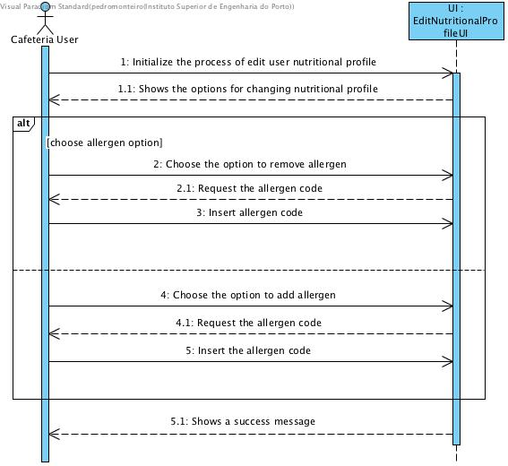
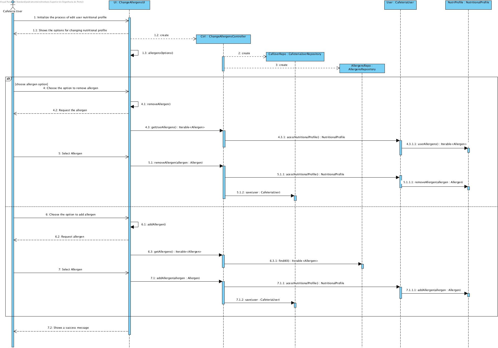

DESIGN
# **UC 4.1.3.2** - edit nutricional profile **allergens**
##	SHORT FORMAT
The user initialize the process of edit user nutritional profile. The system shows the options for changing nutritional profile. The Cafeteria user chooses the option to change their allergens. The system shows the list of allergens and request one of the two options:
* Add allergen:
    * The system requests the allergen code;
    * The cafeteria user inserts the allergen code;
 * Remove allergen:
    * The system requests the allergen code;
    * The cafeteria user inserts the allergen code;
    
The system shows a success message;

###	SSD Short Format

##	LONG FORMAT

### Success Scenario (Basic Flow)
1. The user initialize the process of edit user nutritional profile. 
2. The system shows the options for changing nutritional profile. 
3. The Cafeteria user chooses the option to change their allergens. 
4. The system shows the list of allergens and request one of the two options:
    
    4.1 Add allergen:

        4.1.1 The system requests the allergen;.
        4.1.2 The cafeteria user inserts the allergen;

    4.2 Remove allergen:

        4.2.1 The system requests the allergen;
        4.2.2 The cafeteria user inserts the allergen;

5. The system shows a message informing the sucess of the operation.

### Extensions
    a. The user requests the cancelation of the UC.
        1.  The UC quits.

    3.1
        a. The general Allergens Repository is empty;
            1. The system shows a message informing that the Allergens Repsoitory is empty;
            2. Go to 5.

    4.1.2 
        a. The user already got the allergen in the List;
            1. The system shows a message informing that was not possible to add the allergen;
            2. Go to 1 (The user initialize the process of edit user nutritional profile);
    
    4.2
        a. The list of user's allergen is empty;
            1. The system shows a message showing that the user's allergen list is empty;
            2. Go to 1 (The user initialize the process of edit user nutritional profile);
        

###	Sequence Diagram

### Ocurrence Frequence
* Any time a Cafeteria User wants to change their nutritional profile.

### Opened questions
+ none

### Envolved Agregates
+ User
+ Allergens

### Envolved Repositories
+ CafeteriaUser Repository;
+ NutritionalProfile Repository;
+ Allergen Repository;
+ NutritionalProfile_Allergen Repository;

###Controller
+ ChangeUserAllergensController

###UI
+ ChangeUserAllergensUI